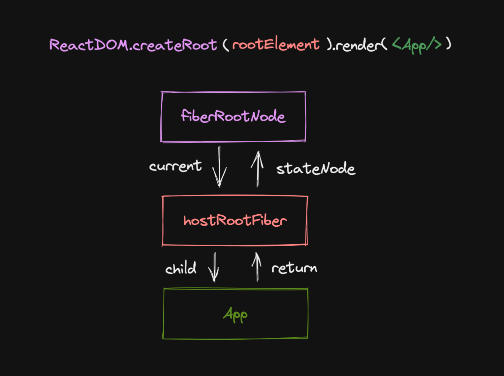
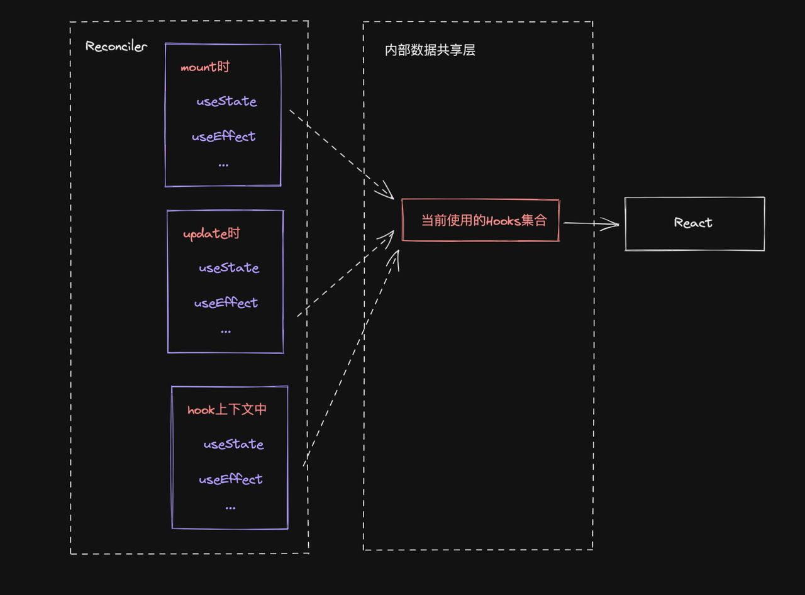

# react-reconciler

对于同一个节点，比较其 React Element 与 FiberNode，生成子 FiberNode，并根据比较的结果生成不同的标记（插入 删除 移动...），之后用于不同的宿主环境执行

遍历规则为 DFS 深度优先遍历，即

- 如果有子节点，就遍历子节点，对应 beginWork
- 如果没有子节点，执行 completeWork，并遍历兄弟节点， 对应兄弟节点的 beginWork
- 如果没有子节点也没有兄弟节点，就回到父节点，并执行父节点的 completeWork

具体逻辑见 workLoop 中 completeUnitOfWork 方法

## 如何触发更新

- ReactDom.createRoot().render
- this.setState
- useState 的 dispatch 方法

需要一套更新机，能够满足上述的多种触发更新的方式

## 更新流程

目的是：

- 生成 wip fiber 树
- 标记副作用 flags

更新流程的步骤：

- beginWork
- completeWork

### beginWork

- mount 阶段

根据 wip fiber 的 memorizedState（存储着 reactElement）和 wip.alternate(即 current fiber)的 child 对比生成 wip.child，同时会给 wip.child 打上 flag

- update 阶段

进行 diff，通过`ChildReconciler`函数比较 current fiber child 和 wip 的 children（hostComponent 对应 props.children,functionComponent 对饮 renderWithHook 结果，即函数运行结果）生成 wip fiber child，在此阶段会判断 children 的类型

- object 类型
  比对 key、type 是否相同，相同即可复用，不同即将当前 current child fiber 加入 wip fiber 的 deletions 字段中，并创建新的 fiber
- Array 类型
- string / number 类型
  文本类型只需比对 current fiber child tag 是否和当前 child 的 tag 相同，即之前是否为文本节点类型的 fiber，相同则更新文本类型，不同则需要创建新的 fiber 并且删除之前的 fiber，把 current child fiber 加入 wip fiber 的 deletions 属性中

### completeWork

产物是包含一些 flags 的 fiber 树

# hooks

hooks 在 mount 时和 update 时功能并不一样，他是如何感知上下执行环境的？很明显这些上下执行环境需要在 reconciler 包中才可以感知到，可以在不同的 hooks 中通过写 ifelse 判断来区分不同的环境；但是 hooks 都是从 react 包中导出，所以需要有链接两个包的桥梁

react 采用的是使用了一个中间层，维护一个 dispatcher 对象，在 reconciler 包中的不同上下文环境中对应不同的 hooks 实现，在执行进入相应的上下文就切换相应的 hooks 实现；同时在 react 包中只暴露 dispatcher 对象即可

