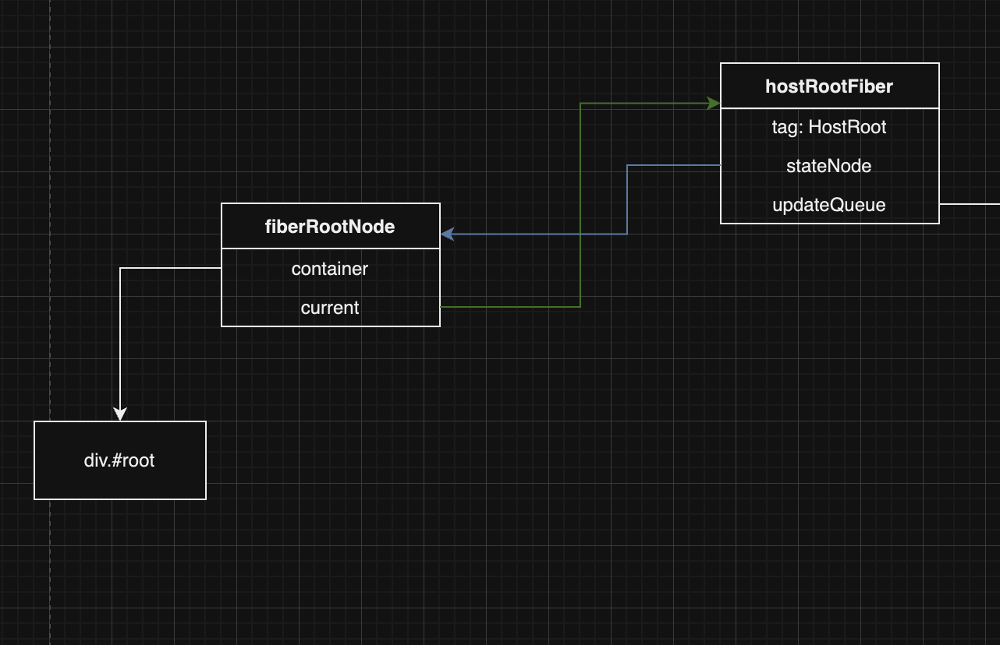
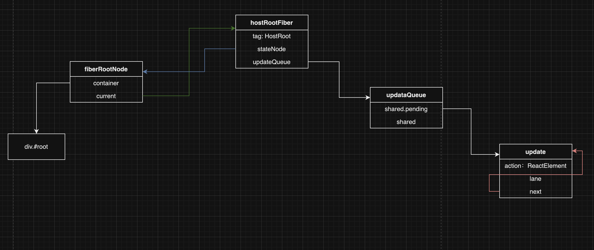

# 主流程

在介绍主流程之前，需要理解 react 中的几种数据结构 / 数据类型：

- jsx
- ReactElement
- fiber

## jsx

是 react 引入的一种可以在 js/ts 文件中书写 html 结构的格式。通过 babel 在运行 jsx/tsx 时转换成 js/ts文件，以达到能够正常运行的效果；这种编译的优化给react 带来了很大的灵活性，相比于 vue 的 template文件，增加了灵活性，但是也增加了编译时优化的难度，所有 react 是一个侧重于运行时优化的框架，而 vue 能够做到编译时优化和运行时优化，性能会更好。

具体的转换可以参考[babel playground](https://shorturl.at/6Md58)

```jsx
import React, { useState } from 'react';
import ReactDOM from 'react-dom/client';

function App() {
	return (
		<div className="wrapper" id="wrapper">
			<span style={{ color: red }}>text</span>
		</div>
	);
}

ReactDOM.createRoot(document.querySelector('#root')).render(<App />);
```

上述 jsx 文件会被 babel 转化为

```js
import React, { useState } from 'react';
import ReactDOM from 'react-dom/client';
import { jsx as _jsx } from 'react/jsx-runtime';

function App() {
	return /*#__PURE__*/ _jsx('div', {
		className: 'wrapper',
		id: 'wrapper',
		children: /*#__PURE__*/ _jsx('span', {
			style: {
				color: red
			},
			children: 'text'
		})
	});
}

ReactDOM.createRoot(document.querySelector('#root')).render(
	/*#__PURE__*/ _jsx(App, {})
);
```

可以看到所有的 html 结构的对象(?)都被转译成了 jsx 函数，jsx 的第一个参数为 html 类型，第二个参数为一个对象，对象中有children 属性，并且按照 html 的嵌套格式再次调用 jsx 函数。

## ReactElement

上述 jsx 函数运行后会返回一个对象，这个对象就是 ReactElement。具体的可以直接上代码

```ts
const ReactElement = function (
	type: ElementType,
	key: Key,
	ref: Ref,
	props: Props
): ReactElementType {
	const element = {
		$$typeof: REACT_ELEMENT_TYPE,
		// react 保留属性字段
		key,
		ref,
		// element type，可以是div span等等，也可以是函数组件App，class组件Form等等
		type,
		// 属性字段，包含children
		props,
		// 区别于真正的react，附加的一个mark属性，标识是我们自己实现的ReactElement
		__mark: 'lwrench'
	};

	return element;
};

const jsx = function (type: ElementType, config: any) {
	let key: Key = null;
	let ref: Ref = null;
	const props: Props = {};

	for (const prop in config) {
		const val = config[prop];

		if (prop === 'key') {
			if (hasValidKey(config)) {
				key = '' + val;
			}
			continue;
		}

		if (prop === 'ref') {
			if (hasValidRef(config)) {
				ref = val;
			}
			continue;
		}

		if ({}.hasOwnProperty.call(config, prop)) {
			props[prop] = val;
		}
	}

	return ReactElement(type, key, ref, props);
};
```

代码简单明了，jsx 会返回一个对象，对象有属性`$$typeof`标识是 ReactElement，key、ref 是 react 中保留属性关键字，type 标识 ElementType，可以是 div span，也可以函数组件或者类组件，props 是 react 的属性字段，包含children 属性。

## fiber

在经过 jsx 函数 运行后的结果（即 ReactElement）会作为`ReactDom.createRoot().render()`的参数开启 react 的首屏渲染，在 react 进行渲染的逻辑中，会区分 mount 和 update 两种情况，分别对应首屏渲染和后续更新。

`createRoot`函数作为 react 主流程的入口，会做一些准备工作，主要是创建FiberRootNode 和 HostRootFiber，它们之间的关系如下图所示：



创建完最初的两个对象后，会在 render 函数中会调用 `createUpdate`函数创建更新，并将更新 enqueue 到hostRootFiber的updateQueue中，此时这个update对象的action为ReactElement，它们之间的关系如下图所示：



在创建更新并将更新enqueue到hostRootFiber的updateQueue之后，就需要消费update，此时会开启react的render阶段，进行react的首次更新。

对于初学react 源码的同学来说，可能还是一头雾水，上文提到的hostRootFiber、fiberRootNode到底是什么东西？

我们直接看下hostRootFiber的定义：

```ts
class FiberNode {
	// 'div' 'span' 'func App' 'class Comp' ...
	type: any;
	tag: WorkTag;
	pendingProps: Props;
	key: Key | null;
	stateNode: any;
	ref: Ref;

	return: FiberNode | null;
	sibling: FiberNode | null;
	child: FiberNode | null;
	index: number;

	memorizedProps: Props | null;
	// function 保存 hooks链表
	memorizedState: any;
	alternate: FiberNode | null;

	// function component fiber中保存effect
	// host root fiber 保存 render函数生成的update，action为<App /> 生成的react element
	updateQueue: unknown;

	// 副作用
	flags: FlagsType;
	subtreeFlags: FlagsType;
	deletions: FiberNode[] | null;

	constructor(tag: WorkTag, pendingProps: Props, key: Key) {
		// fiber的类型
		this.tag = tag;
		this.key = key || null;
		// HostComponent <div> 真实的dom节点
		this.stateNode = null;
		// FunctionComponent ()=>{} / ClassComponent.render()
		this.type = null;

		// 构成树状结构
		this.return = null;
		this.sibling = null;
		this.child = null;
		this.index = 0;

		this.ref = null;

		// 作为工作单元
		// 刚开始的props
		this.pendingProps = pendingProps;
		// 结束时的props
		this.memorizedProps = null;
		this.updateQueue = null;
		// reactElement ?
		this.memorizedState = null;

		this.alternate = null;
		// diff后需要打上的标签，即副作用
		this.flags = NoFlags;
		this.subtreeFlags = NoFlags;
		this.deletions = null;
	}
}
```

我们发现hostRootFiber就是一个fiber对象，但是因为它与fiberRootNode通过current和stateNode直接连接，相对来说比较特殊，所以叫hostRootFiber；我们先关注fiber对象上的几个特殊属性，即在创建fiber时需要传入的参数：tag、pendingProps和key

- tag：不同类型的fiber，具体的有FunctionComponent、ClassComponent、HostRoot（对应hostRootFiber）、HostComponent（对应dom元素，即div span等等）、HostText（对应dom中的文本节点）、Fragment（对应ReactFragment）等等
- pendingProps：类比ReactElement对象中的props
- key：react保留属性

