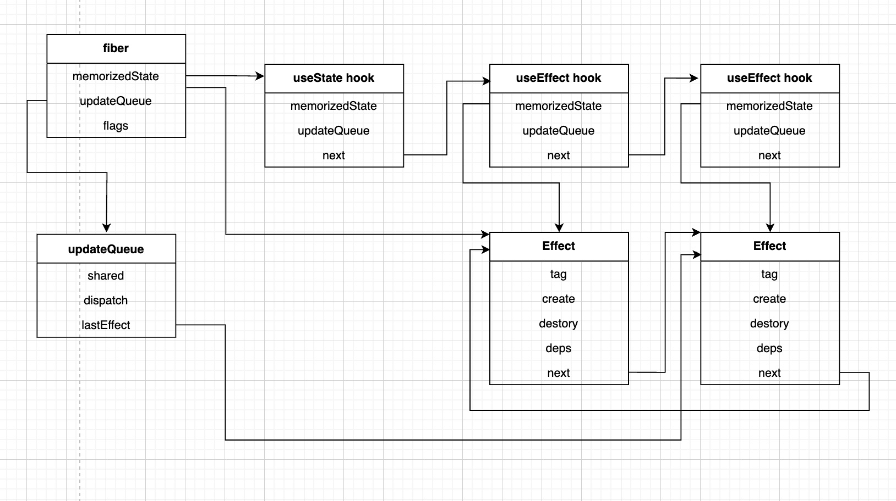

# render 阶段

在 react 的 render 阶段，对于 Function Component 类型的 fiber 会在 beginWork 阶段的 renderWithHook 函数中执行 function，此时会区分 mount 阶段和 update 阶段

## mount 阶段

mount 阶段主要处理两件事：

- 创建 effect hook，维护 hooks 连接
- 给 fiber 打上 tag，用于后续 commit 阶段消费

### 创建 effect hook，维护 hooks 连接

创建 effect

```ts
export interface Effect {
	tag: FlagsType;
	create: EffectCallback | void;
	destroy: EffectCallback | void;
	deps: EffectDeps;
	next: Effect | null;
}
```

- 通过 next 链接所有的 hooks 形成一条链表
- 将在 hook 的 memorizedState 属性上保存 Effect 数据结构
- 同时将所有的 Effect 存在 fiber 的 updateQueue 上，形成一条环状链表，方便在更新的时候能够快速找到所有的 Effect
- 同时也会和 useState 一样，在 fiber 的 memorizedState 属性上生成一条所有 hook 的链表；



### 给 fiber 打上 tag，用于后续 commit 阶段消费

在 mount 时 useEffect 会产生副作用，因此会给当前 fiber 的 flags 打上 PassiveEffect 的标签，会给当前 Effect 对象打上 HookHasEffect 标签

## update 阶段

此时会比较之前存储在 fiber 节点的 memorizedState 的 hooks 链表上的 effect hook，浅比较现 hook 的 memorizedState 属性上存储的 Effect 对象的 deps 和 update 阶段传入的 deps 是否相同，相同则不需要更新，不同则需要更新，给新的 hook 对象的 memorizedState 上存储的 Effect 对象打上 HookHasEffect 的标签，同时给 fiber 对象的 flags 打上 PassiveEffect 标签

# commit 阶段

在 react 中 useEffect 是 commit 阶结束后段异步执行的

大体流程可以分为

- 在 commitRoot 准备阶段利用 Scheduler 注册调度任务
- 在 commitMutation 时收集 Function Fiber 上的 PassiveEffect，并注册在 FiberRootNode 的 pendingPassiveEffects 属性上

```ts
export interface PendingPassiveEffects {
	unmount: Effect[];
	update: Effect[];
}
```

当 commitRoot 同步执行完后，Scheduler 会异步调用之前注册的 flushPassiveEffects 任务，在 flushPassiveEffects 中会先调用 umount 队列中的 Effect，之后调用 update 队列中的 Effect

## 注册调度任务

```ts
import {
	unstable_scheduleCallback as scheduleCallback,
	unstable_NormalPriority as NormalPriority
} from 'scheduler';

function commitRoot(root: FiberRootNode) {
  ...
  	if (
		(finishedWork.flags & PassiveMask) !== NoFlags ||
		(finishedWork.subtreeFlags & PassiveMask) !== NoFlags
	) {
		if (!rootDoesHasPassiveEffects) {
			rootDoesHasPassiveEffects = true;
			// 异步调度副作用，多次执行commit root只调度一次effect
			scheduleCallback(NormalPriority, () => {
				// 执行副作用
				flushPassiveEffects(root.pendingPassiveEffects);
				return;
			});
		}
	}
  ...
}
```

## 收集回调

需要在两种情况下收集 effect：

- fiber 的 flags 有 PassiveEffect，此时是 create 的 effect 回调
- fiber 的 flags 有 ChildDeletion，此时是 destroy 的 effect 回调

收集时只需要将 `fiber.updateQueue.lastEffect` 推入 `root.pendingPassiveEffects` 即可

```ts
function commitPassiveEffect(
	fiber: FiberNode,
	root: FiberRootNode,
	type: keyof PendingPassiveEffects
) {
	// update umount
	if (
		fiber.tag !== FunctionComponent ||
		(type === 'update' && (fiber.flags & PassiveEffect) === NoFlags)
	) {
		return;
	}

	const updateQueue = fiber.updateQueue as FunctionComponentUpdateQueue<any>;
	if (updateQueue !== null) {
		if (updateQueue.lastEffect === null && __DEV__) {
			console.error('当FC存在PassiveEffect flag时，不应该不存在effect');
		}
		root.pendingPassiveEffects[type].push(updateQueue.lastEffect as Effect);
	}
}
```

所以 commit 结束后`root.pendingPassiveEffects`上存储的是每个有 PassiveEffect flags 的 fiber 存储在 updateQueue 上的环状链表的最后一个 Effect，即 lastEffect

## 执行回调

执行回调有顺序，本次更新的任何 create 回调都必须在所有上一次更新的 destroy 回调执行完后再执行。执行顺序为：

- 组件卸载时 destroy 的回调
- 组件更新时 destroy 的回调
- 组件更新时 create 的回调

### 组件卸载时 destroy 的回调

执行时先执行`root.pendingPassiveEffects.unmount`的 Effect 环状链表，遍历每一个存储的 lastEffect，对于每一个 lastEffect，都需要循环遍历完整个环状链表，执行 Effect 上存储的 destroy 方法，还需要去掉 Effect 的 HookHasEffect，防止组件已经卸载却还可以调用 Effect 的 create

```ts
function flushPassiveEffects(pendingPassiveEffects: PendingPassiveEffects) {
  // 每个effect都是lastEffect（环状链表）
	pendingPassiveEffects.unmount.forEach((effect) => {
		commitHookEffectListUnmount(Passive, effect);
	});
	pendingPassiveEffects.unmount = [];

	...
}


export function commitHookEffectListUnmount(
	flags: FlagsType,
	lastEffect: Effect
) {
	commitHookEffectList(flags, lastEffect, (effect) => {
		const destroy = effect.destroy;
		if (typeof destroy === 'function') {
			destroy();
		}
		effect.tag &= ~HookHasEffect;
	});
}

function commitHookEffectList(
	flags: FlagsType,
	lastEffect: Effect,
	callback: (effect: Effect) => void
) {
	let effect = lastEffect.next as Effect;

	do {
		// TODO
		if ((effect.tag & flags) === flags) {
			callback(effect);
		}
		effect = effect.next as Effect;
	} while (effect !== lastEffect.next);
}
```

### 组件更新时 destroy 的回调

同理，只是 Effect 不需要去掉 HookHasEffect 标签

```ts
function flushPassiveEffects(pendingPassiveEffects: PendingPassiveEffects) {
  ...
  // 每个effect都是lastEffect（环状链表）
	pendingPassiveEffects.update.forEach((effect) => {
		commitHookEffectListDestroy(Passive | HookHasEffect, effect);
	});

	...
}

export function commitHookEffectListDestroy(
	flags: FlagsType,
	lastEffect: Effect
) {
	commitHookEffectList(flags, lastEffect, (effect) => {
		const destroy = effect.destroy;
		if (typeof destroy === 'function') {
			destroy();
		}
	});
}
```

### 组件更新时 create 的回调

同理执行所有 create 函数，因为可能在 create 函数中调用 setState，所以执行结束后再次调度清空所有更新

```ts
function flushPassiveEffects(pendingPassiveEffects: PendingPassiveEffects) {
	...
	// 本次更新的任何create回调都必须在所有上一次更新的destroy回调执行完后再执行。
	pendingPassiveEffects.update.forEach((effect) => {
		commitHookEffectListCreate(Passive | HookHasEffect, effect);
	});
	pendingPassiveEffects.update = [];
	// 回调过程中可能触发更新
	flushSyncCallbacks();
}

export function commitHookEffectListCreate(
	flags: FlagsType,
	lastEffect: Effect
) {
	commitHookEffectList(flags, lastEffect, (effect) => {
		const create = effect.create;
		if (typeof create === 'function') {
			effect.destroy = create();
		}
	});
}
```
