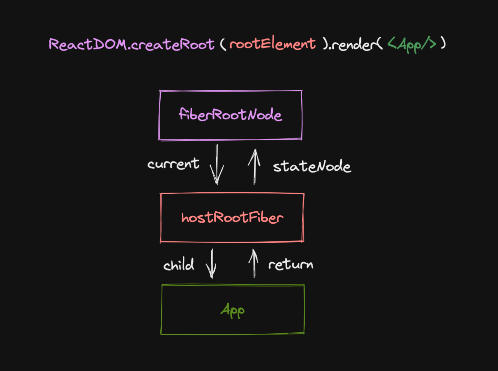

# react-reconciler

对于同一个节点，比较其 React Element 与 FiberNode，生成子 FiberNode，并根据比较的结果生成不同的标记（插入 删除 移动...），之后用于不同的宿主环境执行

遍历规则为 DFS 深度优先遍历，即

- 如果有子节点，就遍历子节点，对应 beginWork
- 如果没有子节点，执行 completeWork，并遍历兄弟节点， 对应兄弟节点的 beginWork
- 如果没有子节点也没有兄弟节点，就回到父节点，并执行父节点的 completeWork

具体逻辑见 workLoop 中 completeUnitOfWork 方法

## 如何触发更新

- ReactDom.createRoot().render
- this.setState
- useState 的 dispatch 方法

需要一套更新机，能够满足上述的多种触发更新的方式

## 更新流程

目的是：

- 生成 wip fiber 树
- 标记副作用 flags

更新流程的步骤：

- beginWork
- completeWork

### beginWork

产物是

### completeWork

产物是包含一些 flags 的 fiber 树
